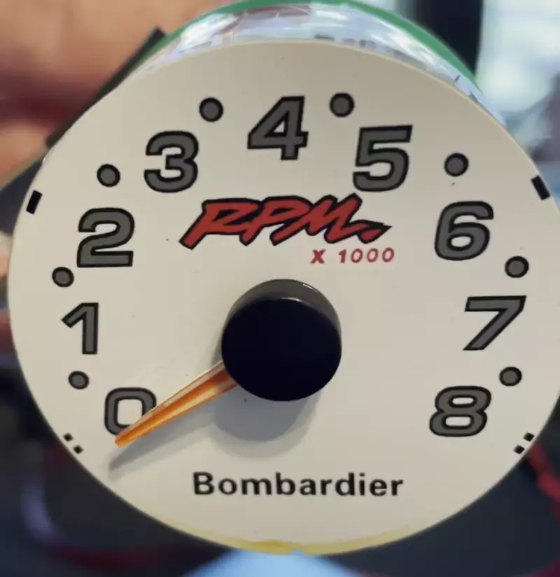

# April 17, 2022

## Why
My wife has a 1998 Sea Doo Sportster 1800 that she absolutely loves.  It was the largest boat we could tow with the car
we have.  Unfortunately, it's age has made getting parts difficult.  Finding mechanical parts has been fairly easy for 
our mechanic because the Rotax 717 engines and jet pumps were used in a lot of products.  However, the electrical parts
are no longer manufactured and while you can find used ones they can be expensive for something that may fail soon due 
to age.

When my wife bought the boat, the dash gauges all worked fairly well.  We did have some inconsistency wth one of the
tachometers going out if we hit a wake hard, but that was about it.  After a year though we started having issues with
it working overall.  After that, I learned to gauge the RPM of the engine based on its sound and the other engines
sound which had a working tachometer.  Unfortunately my wife isn't as good at that. So at the end of 2021, I decided I 
wanted to make her a new tachometer as a project.

## Temperamental Tachometer

Here's the front and rear of temperamental Tachometer that works sometimes and then stops working.

    
    

When it works, the dial gauge moves as the engine revs all the way through its RPM range.  When it first started being
temperamental, it worked at low RPM ranges and would stick at 5500 RPM.  For us, the low RPM ranges were more important
because the engine would stall at around 750 RPM and at that time we hadn't adjusted the engine idle correctly.

We found that if we put downward pressure on the wires, it would work.  This led us to believe it was a contact issue
between the tachometer and the wiring harness.

## Cheap Solutions
### Pressure From Tape

Our first attempt at fixing (well making it less annoying) was to tape the wires to the harness.  We had some Gorilla
tape on the boat to put enough pressure for a contact to be made.  This worked for maybe an hour, but we could wiggle it 
and put more tape every time it stopped working.  However, after a month we could no longer get a connection with 
pressure from tape.

### Contact Cleaning

Now that tape no longer worked, we decided that we should clean the terminals in the connectors.  We bought some contact
cleaner and used some wire brushes meant for air brushing.  After cleaning and scraping for about 15 minutes we had some
contact again.  But within an hour it got temperamental again and would go out.  But every once in a while it would come
back on as we crossed a wake.

## How It Works

After the simple solutions didn't work, it's now time to figure out how the Tachometer actually works.  My wife had
actually bought a shop repair manual because we expected things to fail.

    

Unfortunately, when we actually went to the section this is what we found.

    

Time to start reverse engineering how it works.  Looking at the harness when in the boat, I thought the colors of the
wires might be helpful.

    

The entire boat runs off a 12V system provided by the battery.  So I thought I might be able to probe the contacts in
the Tachometers socket and see what happened.  There is a black wire coming out of the harness, I figured that was
most likely ground.  With that assumption, I set up my power supply for 12V DC and began probing.

**Note: When I originally did this probing, I had not cut open the Tachometer.  The pictures you are seeing are
recreations of the steps I took.**

    

It was fairly quick to see that something happened.  The first two pins complete the light circuit.

    
    

I still wasn't sure whether black was ground or not, so I reversed the polarity.  Unfortunately thr light came back on.

Still assuming black was ground, I went on to probe the next pin.  It did something.  When I made contact with the first
pin and the third pin, the dial moves just slightly.

    

I was still wondering if black was ground, so I reversed the polarity and nothing happened!  That means that black is
ground!  Now that kinda we know what three pins map to, lets keep track of them.

    

|Pin|Wire Color| Function |Polarity|
|---|----------|----------|--------|
| 1 |Black| Ground   |-|
| 2 |Blue| Light    |+|
| 3 |Purple| Power?   |+|
| 4 |None| N/A      ||
| 5 |Gray| ?        |?|
| 6 |None| N/A      ||

We know that this is a mechanical gauge so that means there has to be a way of moving the dial.  My first attempt was to
adjust the voltage going into pin three.  That did nothing.  So we know that if pin three is doing anything it's
probably providing the power needed to read something.

I remember looking for a few hours and not finding anything helpful until I stumbled upon a reply from Nutz13
[http://greenhulk.net/forums/showthread.php?t=206298](http://greenhulk.net/forums/showthread.php?t=206298).  They had
a later tachometer but the gray pin was signal.

I wondered if mystery pin five was a voltage sensor.  So I set up a second power supply to a low voltage, linked the
grounds, and probed pin five.  And... nothing happened again.  I increased the voltage all the way up to 12V and still
nothing happened.  Time for some GoogleFu.

**Note: At one point I had managed to get the dial to move to about 500 RPM by touching one of the wires to something.
I don't remember exactly what but this led me down a wild goose chase for a while.**

After some more Googling, I stumbled upon a post for a car
Tachometers that said it might be using [Pulse Width Modulation (PWM)](https://en.wikipedia.org/wiki/Pulse-width_modulation).
I didn't know what that is but after reading, I thought I could test it fairly easily.  I hooked up my second power
supply again and this time I just tapped the signal wire against positive voltage.  And... it moved!

    

All of this was super hacky, but it actually worked!  So I now knew that pin five was a PWM input signal.

|Pin|Wire Color| Function               | Polarity |
|---|----------|------------------------|----------|
| 1 |Black| Ground                 | -        |
| 2 |Blue| Light                  | +        |
| 3 |Purple| Power?                 | +        |
| 4 |None| N/A                    ||
| 5 |Gray| Pulse Width modulation | +        |
| 6 |None| N/A                    ||

## Next

[In the next entry, I go over analyzing the PWM signal and tracking down the replacement connectors.](../18-04-2022/entry.md)