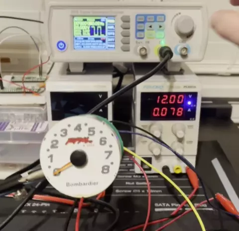
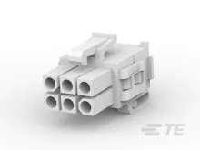
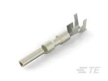
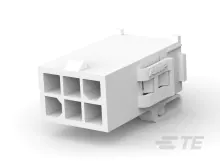
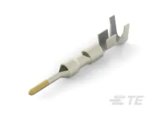
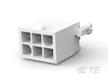

# April 18, 2022

## Previous

[In the previous entry I went over the broken Tachometer and why I'm doing this project.](../17-04-2022/entry.md)

## Analyzing PWM

Now that I had figured out how to make the Tachometer move, it was time to figure out the signal range.
I originally thought about using an Arduino and building a PWM generator, but I had only used an Arduino ones for a 
Christmas light project with my wife.  Always looking for an excuse to buy a tool, I went on Amazon
and bought a dedicated signal generator.
[Koolertron 15MHz](https://www.amazon.com/gp/product/B07211YWMK/ref=ppx_yo_dt_b_search_asin_title?ie=UTF8&th=1). It's
worked well for me so far.  I don't have any experience with signal generators so I don't know if it's very good or not.  
But it has done what I needed it to so far.

    

Using the signal generator and fiddling with the wires to get a decent connection, I was able to figure out a close PWM
range.

    

|PWM Freq (Hz)|Voltage|RPM|
|-------------|-------|---|
|0|12|0|
|28|12|500|
|46|12|1000|
|66|12|1500|
|78|12|2000|
|86|12|2500|
|96|12|3000|
|106|12|3500|
|120|12|4000|
|136|12|4500|
|158|12|5000|
|184|12|5500|
|214|12|6000|
|228|12|6500|
|242|12|7000|
|258|12|7500|
|270|12|8000|

With this information, I finally had enough to not only fix the Tachometer, but also design a digital one if I wanted.

## Tracking Down Connectors

At this point, keeping the wires attached to the pins with an already finicky connector was becoming a pain.  It was
time to track down the male and female terminals.  I spent quite a few hours looking for Molex connectors to no success.
However, when randomly looking at a page in the manual for something else I stumbled across something called an AMP
connector.  A few hours later I had finally found the connectors I was looking for.  They are Mini-Universal 
MATE-N-LOK 2 series and available from TE.com.

| Connector          |Part Number|Link|Image|
|--------------------|----------|----|-----|
| Male Housing       |794190-1|https://www.te.com/usa-en/product-794190-1.html?te_bu=Cor&te_type=email&te_campaign=oth_usa_cor-oth-usa-email-ecomm-fy19-hbrs-oconf-prdlink_sma-716_2&elqCampaignId=37418||
| Male Housing Pin   |1-794221-0|https://www.te.com/usa-en/product-1-794221-0.html?te_bu=Cor&te_type=email&te_campaign=oth_usa_cor-oth-usa-email-ecomm-fy19-hbrs-oconf-prdlink_sma-716_2&elqCampaignId=37418||
| Female Housing     |794191-1|https://www.te.com/usa-en/product-794191-1.html?te_bu=Cor&te_type=email&te_campaign=oth_usa_cor-oth-usa-email-ecomm-fy19-hbrs-oconf-prdlink_sma-716_2&elqCampaignId=37418||
| Female Housing Pin |1-794228-0|https://www.te.com/usa-en/product-1-794228-0.html?te_bu=Cor&te_type=email&te_campaign=oth_usa_cor-oth-usa-email-ecomm-fy19-hbrs-oconf-prdlink_sma-716_2&elqCampaignId=37418||
| Female PCB Housing |770178-1|https://www.te.com/usa-en/product-770178-1.html?te_bu=Cor&te_type=email&te_campaign=oth_usa_cor-oth-usa-email-ecomm-fy19-hbrs-sconf-prdlink_sma-716_7&elqCampaignId=37423||

Now with the connectors I can more easily test and repair the Tachometer.

