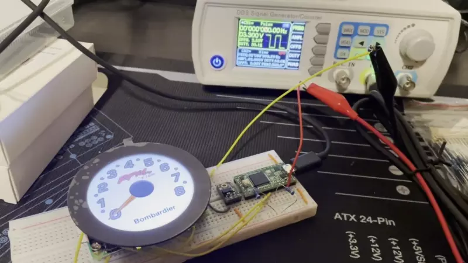

# April 24, 2022

## Previous

[In the previous entry I went over analyzing the original Tachometer](../18-04-2022/entry.md)

## Repairing Original Tachometer

Now that we have all the information from the original Tachometer, it's time to repair it so we can use it this year.
In the previous entry, I briefly talked about the connectors used on the Tachometer.  Internally, the Tachometer uses a
[770178-1](https://www.te.com/usa-en/product-770178-1.html?te_bu=Cor&te_type=email&te_campaign=oth_usa_cor-oth-usa-email-ecomm-fy19-hbrs-sconf-prdlink_sma-716_7&elqCampaignId=37423) 
through hole housing with the pins already inserted.  Here's the Tachometer before removing the original housing.

    

To remove the socket, I had to use a hot air gun to soften the solder joints on each pin.  This was tricky because if I
got the gun close it would start melting the socket or surrounding plastic.  But if I turned down the temperature the
solder itself wouldn't melt.  I had to push each pin down individually as they heated up and use a 
[solder removal pump](https://www.amazon.com/gp/product/B07BB8DGMP/ref=ppx_yo_dt_b_search_asin_title?ie=UTF8&psc=1)
to get as much excess solder away.  With all the pins push down, the heat gun could finally warm up all the joints and
I was able to pull the socket off.

    

I then pushed the tip of my soldering iron into each hole and used the solder pump to clear out enough solder for the
new housing.  Using a pair of small pliers and the heat gun, I was able to slowly push through the pins on the new
housing and solder it to the board.

    

Now that it was soldered on, it was time to test that it worked.  I hooked it back up to my signal generator and
verified that it would read the PWM without having to put pressure on any of the wires.

    

AND IT WORKED!!!  My wife and I put it in the boat this week and everything worked properly!  We have a working
Tachometer again which was really nice.

## New Digital Tachometer

I've focused on repairing the original Tachometer up to this point.  Over the past few months I actually started playing
around with Arduinos, Teensys, Pis, and some Pimoroni displays.  As a backup plan to not being able to fix the 
Tachometer, I decided I would create a digital version.  What I'm about to show you is iteration two that uses a
Raspberry Pi Zero W2, a Teensy 3.2, and a Pimoroni 2.1 Round screen.

    

I actually got to try this version in the boat when we dewinterized it.  However, after it boots, the OpenGL app I wrote
draws too much current and it trips a relay.  The remaining entries in this series will be focused on designing an
entire replacement dashboard that utilizes three Pies, Pimoroni screens, and Picos.